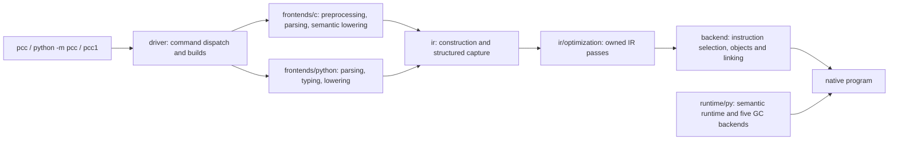

# 01 · System Overview

PCC compiles Python and C through separate frontends into its owned IR and
self backend. Shared command semantics and execution ownership are requirements
in [Project Intent](../project-intent.md) and
[compiler-contract.md](../compiler-contract.md).

## Compilation flow

IR text uses LLVM syntax. The IR builder and indexed capture are PCC code;
they do not require LLVM libraries. C AST/SSA transformations live with the C
frontend; shared final-IR transformations live under `ir/optimization`.

## Directory responsibilities

| Path | Responsibility |
|---|---|
| `pcc/driver/` | CLI dispatch, project/TU collection, cache identity and shared source/resource paths |
| `pcc/frontends/c/` | C preprocessing, AST, lexing/parsing, semantic lowering, C AST/SSA passes and evaluation |
| `pcc/frontends/python/` | Python parsing/lifting, type inference, lowering, native import/export closure and runtime build coordination |
| `pcc/ir/` | Shared IR builder, thin imports, structured indexed capture and internal floating-point serialization helpers |
| `pcc/ir/optimization/` | Owned mem2reg/SROA, scalar/CFG transforms, DCE and inlining |
| `pcc/backend/` | Target ABI/instruction lowering, assemblers, object formats, relocations, linking and signing |
| `pcc/runtime/py/` | Production runtime implementations authored in pcc-Python, including all five GC backends |
| `pcc/runtime/src/`, `pcc/runtime/include/` | Runtime migration mirrors and ABI headers; source presence is not production-link evidence |
| `pcc/stdlib/` | Owned standard-library providers selected by native import resolution |
| `pcc/package/` | Package acquisition, metadata, install/build flows and generic array planning |
| `pcc/diagnostics/` | Diagnostics, profiling, artifact inspection and contract checkers |
| `pcc/library/` | Ordinary Python helper libraries and models; presence/tests do not establish native compiler integration |
| `pcc/support/` | Shared compiler implementation helpers |
| `pcc/tools/` | Maintainer-facing IR/object/provenance tools |
| `tests/fixtures/libc/` | Attributed C reference sources consumed by live differential tests |
| `scripts/qualification/` | Host-side release contracts, workload catalogues and evidence validation |

GPU kernel IR, distributed models and GPU GC models retain their own extension
packages. They do not replace the self-host/five-GC qualification spine.

## Top-level file review

| File | Why it belongs at the package root |
|---|---|
| `__init__.py` | Defines package exports. Its current diagnostics wiring is an import side effect, not proof of a minimal import closure. |
| `__main__.py` | Implements `python -m pcc` and remains the self-host source entrypoint. |
| `api.py` | Publishes `build`, `module`, `BuildArtifact` and `Module`, exposed by the package root and README. |
| `value_model.py` | Public value-class/array/integer-buffer markers and implementations used by compiler lowering. |
| `gpu.py` | Public kernel markers recognized by the GPU frontend. Device qualification is separate. |
| `virtual_thread.py` | Public compiler-recognized virtual-thread operations. |
| `library/effects.py` | Scoped effect dispatch library with one shared continuation and thread-local handler stack. The early duplicate runtime prototypes are retired. |

Array planning helpers moved to `package`; category/runtime-effect checking
models moved to `diagnostics/contracts`; ordinary ADT, functional, persistent,
trait and buffer models moved to `library`. Effect module paths remain stable. These moves preserve
implementations and their tests. Similar names do not make the models
interchangeable: the sealed-ADT and effect variants have different APIs.

The duplicate Click adapter `pcc.py` was removed after its CLI tests moved to
the shared driver. The C API publishes owned shared libraries on CPython Darwin
arm64; other shared-library targets/publication owners fail explicitly at the
remaining boundary. Directory organization alone establishes neither capability
nor release qualification.

## Location and validation rules

Source/resource resolution is centralized in `driver/paths.py`; it preserves
explicit source-root and installed-prefix selection for native compilers whose
`__file__` can be synthetic. Cache/freshness inventories must include the new
owners. Runtime archive and sidecar basenames remain stable; old provenance
receipts retain their recorded source identity and cannot qualify new layouts.

Run focused interface tests and emitted programs first, then rebuild the
host→pcc1→pcc2→pcc3 chain and require raw byte equality. Previous-layout receipts
remain previous-layout evidence.
