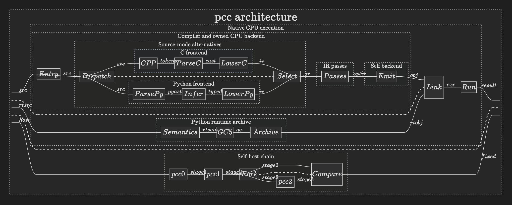

# pcc architecture · pyncd diagram

[Interactive diagram](pcc-pyncd-architecture.html) · [SVG](pcc-pyncd-architecture.svg) · [PNG](pcc-pyncd-architecture.png) · [source](render_pyncd_architecture.py)



The upper circuit follows a CPU compile: public entry → selected C or Python
frontend → IR passes → owned self backend → native artifact. The runtime is a
separate input to the link for **Python** executables; a C-only output need not
link the Python runtime. The C and Python lanes are **alternatives** selected by
the driver, not two frontends run for every input. The lower circuit shows
host pcc0 building pcc1, pcc1 building pcc2, and pcc2 building pcc3; the final
comparison is pcc2 versus pcc3. A pcc1 build alone is not a fixed point.

The diagram uses [pyncd](https://github.com/mit-zardini-lab/pyncd)'s
compositional wires to label *compiler artifacts*. They are not tensor axes or
an assertion that each stage is a pure mathematical function. Click or hover
over a block in the HTML for source ownership and boundary notes. The
[DeepSeek-V4.1-Flash diagram](https://vtabbott.io/diagrams/deepseek-v41-flash/)
is the visual reference: dark canvas, thin wires, nested stages and inspectable
blocks.

The public default `self` backend is in `pcc/driver/cli_contract.py`. Current
implementation paths are in `pcc/driver/cli_core.py`, `pcc/driver/cli_bootstrap.py`,
`pcc/frontends/python/pipeline.py`, `pcc/frontends/c/evaluator/c_evaluator.py`, `pcc/backend/`
and `pcc/runtime/`. The [project intent](../project-intent.md) and
[compiler contract](../compiler-contract.md) state the destination; they do not
establish which migration gaps are closed in today's tree. Explicit LLVM
routes, optional libpython compatibility and the bounded Metal kernel path
have separate proof boundaries and are omitted from the main CPU circuit.
The labels were checked on 2026-09-24 against the working tree based on
`dd19f4a15018ea1ddd5750b5ba479e5afcc98ca9`; the generated graphics are
not an execution or fixed-point receipt.

## Regenerate

This is documentation tooling. pyncd and tsncd are **not** pcc build or runtime
dependencies. The checked diagram was generated from pyncd
`263734d63c2e3c63a2252b646429c9a2d11f3e5a` and tsncd
`5b5d554c52966355ad851d2209df90b26d2a1669` with Python 3.13.

From the repository root:

```bash
git clone https://github.com/mit-zardini-lab/pyncd.git /tmp/pcc-pyncd
git -C /tmp/pcc-pyncd checkout 263734d63c2e3c63a2252b646429c9a2d11f3e5a
git clone https://github.com/mit-zardini-lab/tsncd.git /tmp/pcc-tsncd
git -C /tmp/pcc-tsncd checkout 5b5d554c52966355ad851d2209df90b26d2a1669
cd /tmp/pcc-tsncd
npm ci
npm run build
cd /path/to/pcc
env -u LC_ALL uv run --no-project --python 3.13 --with playwright playwright install chromium
PYTHONPATH=/tmp/pcc-pyncd env -u LC_ALL uv run --no-project --python 3.13 --with websockets --with playwright python docs/architecture/render_pyncd_architecture.py --tsncd-dist /tmp/pcc-tsncd/dist
```

The script writes a standalone HTML with the tsncd viewer embedded, plus SVG
and PNG previews, all under `docs/architecture/`.
